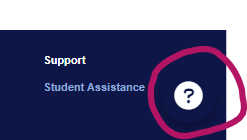
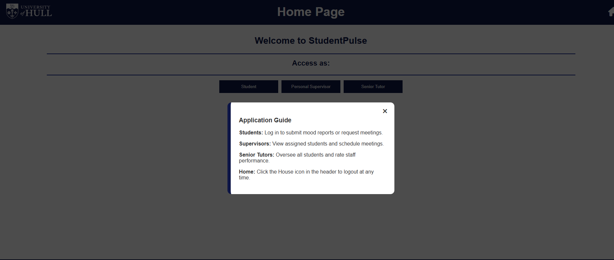
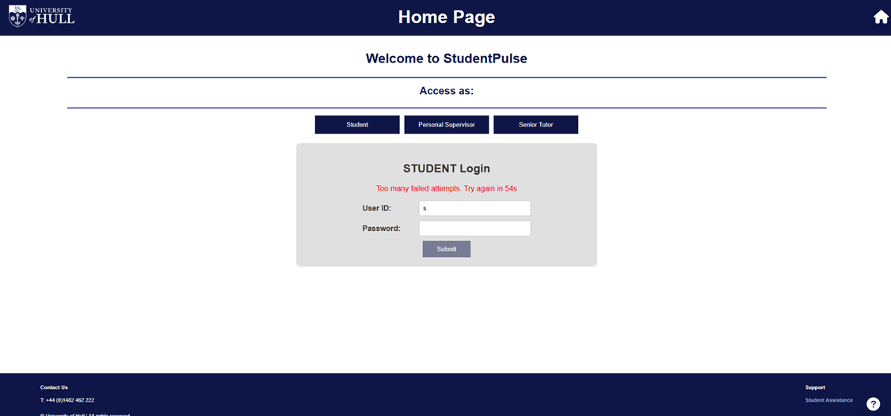

# After Adjustments – Personal Supervisor System

## Overview
This folder contains the **updated version** of the Personal Supervisor System following user testing and evaluation.

The application is based on the **StudentPulse prototype**, a functional front-end web interface designed to support interaction between students, personal supervisors, and senior tutors, with a focus on monitoring student wellbeing and academic support.

---

## Before Adjustments (Baseline System)

The original system provided:

- A functional interface for three user roles:
  - Students  
  - Personal Supervisors (PS)  
  - Senior Tutors (ST)  

- Core features including:
  - Student self-reporting of wellbeing  
  - Meeting booking between students and supervisors  
  - Monitoring of student status using a traffic-light system  
  - Oversight capabilities for Senior Tutors  

- A responsive front-end built using:
  - HTML, CSS, and JavaScript  
  - Simulated backend using local data storage  

While the system was fully functional, user testing highlighted the need for improved **user guidance, clarity, and security**.

---

## Implemented Adjustments

### 1. Help Button

A **Help button** has been added to enhance usability by providing users with immediate guidance.

#### Functionality
- Displays a brief explanation of how to use the system  
- Guides users through key features such as:
  - Reporting wellbeing  
  - Booking meetings  
  - Viewing system status  
- Easily accessible from the interface at any time  

  

---

### 2. Login Security Lockout

A **login lockout mechanism** has been implemented to improve system security.

#### Functionality
- After **3 failed login attempts**, the system temporarily disables further login attempts  
- The login form is locked for **60 seconds** before allowing new attempts  

#### Purpose
- Prevents brute-force attacks by blocking repeated incorrect attempts  
- Encourages users to enter correct credentials carefully  
- Introduces a basic but effective **security standard** into the system  
- Provides clear, time-based feedback to the user  

---

## Repository Structure

- `index.html`  
  The main entry point of the application, containing the structure and all SPA views.

- `style.css`  
  Handles the visual design, including layout, responsiveness, and color contrast.

- `script.js`  
  Contains the application logic, including user interactions, login simulation, and LocalStorage data handling.

- `logo3.jpeg`  
  University of Hull branding used within the interface.

---

## How to Run

To run the application:

1. Download or clone the folder contents  
2. Open the `index.html` file in any modern web browser (Chrome, Firefox, Edge, etc.)  

No additional setup or installation is required.

---

## Summary

The implemented adjustments focus on improving both **usability and security**:

- The **Help button** enhances user understanding and guidance  
- The **login lockout mechanism** strengthens system security and reliability  

These improvements demonstrate an iterative design approach based on user feedback, aligning with UI/UX best practices.